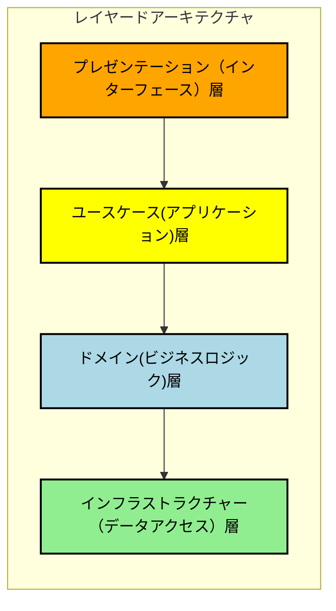
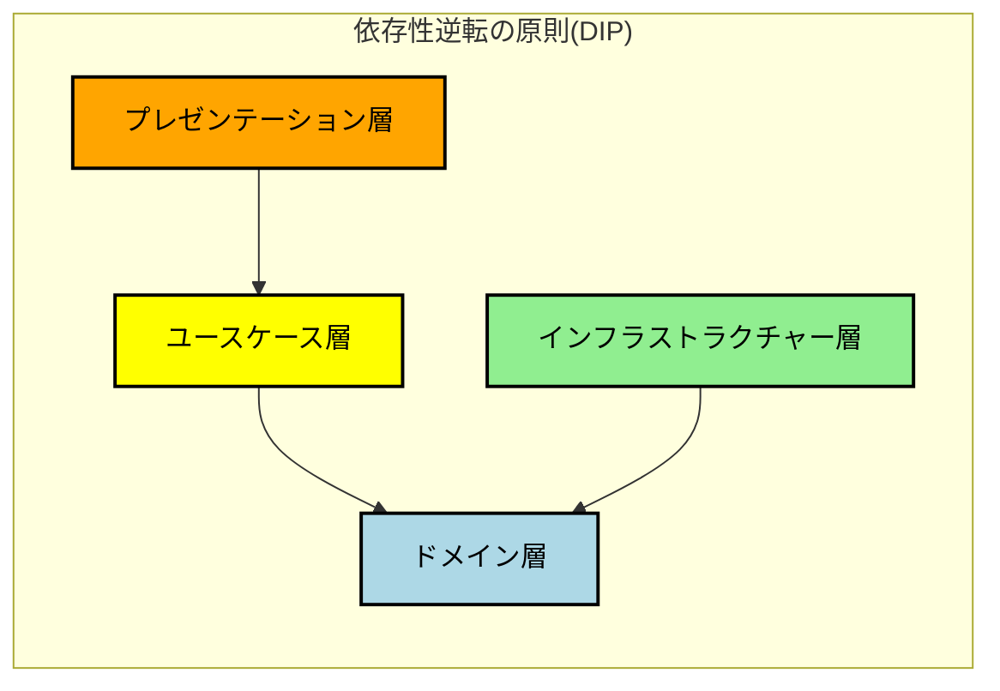

# History of Architecture

2024/08/01 presentation for 社内勉強会

@kazu_kichi_67

  <a href="https://x.com/kazu_kichi_67" target="_blank" alt="X" title="Open in X"
    class="text-xl slidev-icon-btn opacity-50 !border-none !hover:text-white">
    <carbon-logo-x />
  </a>
  <a href="https://github.com/kazu-kichi-67" target="_blank" alt="GitHub" title="Open in GitHub"
    class="text-xl slidev-icon-btn opacity-50 !border-none !hover:text-white">
    <carbon-logo-github />
  </a>

---
src: ./pages/who-am-i.md
hide: false
---

---
hideInToc: true
---

# Agenda

***

 
<Toc maxDepth="2"/>

---
hideInToc: true
---

# はじめに

***

- アーキテクチャの思想を知ることの重要性
  - システムの理解を早める
  - アンチパターンを避ける
  - 保守性、品質、開発効率の向上
  - 上流工程への参画
  - 市場価値の向上
- 2025年の崖
  - 既存システムのレガシーシステム化
    - リプレイス案件の増加が予想される
  - IT人材不足
    - 人が多ければいいってもんじゃない
    - 最新トレンドに沿った、リアーキテクティングのスキルが重要

今、本当に現場で求められているスキルを学びましょう

---
hideInToc: true
---

# 注意点

***

 

- 情報量が多いので、この場で全てを理解するのは難しいと思います
- 頻出単語の関連性や、IT業界全体の流れを把握し、今後の勉強の足掛かりにしてほしい

---
layout: section
---

# アーキテクチャーの変遷

---
layout: section
---

## システム全体編

---

### モノリス

***

 

 

### メリット

<v-click>

- 1つのアプリケーションのため、デプロイが容易
- スタートアップであれば、これで十分な場合も多い

</v-click>

 

### デメリット

<v-click>

- アプリケーションが多くなればなるほど複雑化しやすい（Big Ball of Mat: 大きな泥団子）
  - 修正に対する影響範囲が広く、開発スピードが低下する
  - 影響範囲の特定すら難しく、サービス品質が低下する
- 機能毎にスケールすることが出来ない（弾力性×）
- 1つのアプリケーションがダウンすると、そのままサービス停止へ（耐障害性×）

</v-click>

---

### マイクロサービス

***

 

 

### メリット

<v-click>

- 機能毎に疎結合となり、互いに修正の影響を受けづらい
- 機能単位でのデプロイ、スケーリングが可能
- 障害の影響を最小限にできる
- コンテナ環境と相性が良い

</v-click>

 

### デメリット

<v-click>

- デプロイ、サービス管理のコストが高い
- マイクロサービス間通信によるオーバーヘッド
- 解析時に流れを追うのが難しい
- トランザクションを貼れないため、データの一貫性を担保しづらい
  - sagaパターン
- マイクロサービス間の境界を見極めるのが難しい

</v-click>

---

### モジュラモノリス

***

 

 

マイクロサービスのデメリットを緩和できる

### メリット

<v-click>

- デプロイ、サービス管理のコストが低め
- モジュール間のやり取りでオーバーヘッドが少ない
- オーケストレーター層を置いてトランザクション管理することも可能
- モジュール間の境界を見誤っても、リカバリしやすい

</v-click>

 

### デメリット

<v-click>

- マイクロサービスほど自由にスケール出来ない
- モジュール境界の管理をしっかりやらないと、モノリスと変わらなくなる

</v-click>

<v-click>

マイクロサービスとモジュラモノリスのハイブリットもおすすめ。
組織のスケールに合わせて少しずつマイクロサービスへ移行する！

</v-click>

---
layout: section
---

## フロントエンド編

---

### MVC

***

 

 

- Classic MVC、MVC 2とか存在する
- Controllerが入力を受け付けて、Model-Viewの橋渡しを行う
- Struts、Spring MVC、Laravel、CakePHP、FuelPHP、Ruby on Rails

 

### メリット

<v-click>

- View（画面のレイアウト）とModel(ビジネスロジックやデータ管理)を分離できる
- 同じModelでViewだけ切り替えることが可能

</v-click>

 

### デメリット

<v-click>

- 大規模アプリケーションでは、Controllerが肥大化しやすい
- ViewとModelの結合度が高くなりがち

</v-click>

---

### MVP

***

 

 

- PresenterがModelとViewの仲介を行う

 

### メリット

<v-click>

- Presenterがイベントハンドリングを担う
 - ViewがModelの変更を監視する(Observe)パターン
 - パッシブビュー(Passive View)
- パッシブビューによって完全にViewと分離できるので、よりテストがしやすい

</v-click>

 

### デメリット

<v-click>

- Presenterが肥大化しやすい
- ViewとPresenterの1対1の関係が必要で、柔軟性に欠ける場合がある

</v-click>

---

### MVVM

***

 

 

- データバインディング
  - React.js: 単方向バインディング、Vue.ja: 双方向バインディング

 

### メリット

<v-click>

- MVPとそこまで変わらないが、ViewとViewModelの連携をフレームワークが担ってくれる

</v-click>

 

### デメリット

<v-click>

- 最初の学習コストが高い

</v-click>

---
layout: section
---

## バックエンド編

---

### レイヤードアーキテクチャ

***

 

※ 矢印は依存の向き

※ 3層の場合もある（層の数に決まりはない）

 

### メリット

<v-click>

- 各層に特定の役割（責務）を与えることで、コードの見通しが良くなる（単一責任の原則 SRP）
- 上層の変更に対して、下層が影響を受けない
  - 使い回しが出来る

</v-click>

 

### デメリット

<v-click>

- 下層の変更によって、上層が影響を受ける
- つまり、インフラストラクチャーを変更すると、ビジネスロジックが影響を受けてしまう

</v-click>

---

### ヘキサゴナルアーキテクチャ

***

 

 

 

- 別名、Ports and Adapters

 

### メリット

<v-click>

- Port層によってApplicationが守られているので、外部の変更に対して強い
- Application（ビジネスロジック）の独立性が高く、テストが容易

</v-click>

 

### デメリット

<v-click>

- 初期の設計が複雑になりがち
- 小規模なシステムだと過剰な設計になりうる

</v-click>

---

### オニオンアーキテクチャ

***

 

 

- ドメインを中心にして設計される
- 外から中への依存

 

### メリット

<v-click>

- ドメインが何にも依存せず、外側の影響を受けない
- テストが容易
- ビジネスロジックの再利用性が高い

</v-click>

 

### デメリット

<v-click>

- 小規模なシステムには不向き

</v-click>

---

### クリーンアーキテクチャ

***

 
 

 

- ドメイン（エンティティ）を中心にして設計される
- 外から中への依存

 

### メリット

<v-click>

- テストが容易
- フレームワークやデータベースの変更に強い
- ビジネスロジックの明確な分離

</v-click>

 

### デメリット

<v-click>

- 小規模なシステムだと、作るものが多く冗長になりうる
- 初期の学習コストが最も高い

</v-click>

---

### ドメイン駆動設計（DDD）

***

 

- 戦術的DDD
  - 実装パターンやレイヤー設計のパターン
  - Repository、Domain Service、Value Object、Entityなど
  - こちらのみ：軽量DDD

- 戦略的DDD
  - ドメイン（システムにおける本質的に重要な部分、ビジネスロジック）をモデリングする手法
  - ユビキタス言語、境界づけられたコンテキスト、ドメインエキスパート、サブドメインなど
  - 手法：イベントストーミング、ユースケース分析、ドメインストーリーテリングなど

---
layout: section
---

# トレンド

---
layout: section
---

## CQRS

---

### CQRS

***

 

 

- Command Query Responsibility Segregation: コマンド・クエリ責務分離
- 複数の集約単位を跨るようなリードモデルが欲しくなる
  - 一覧画面のようなもの、N+1問題

### メリット

<v-click>

- ドメインモデルの最適化
- 更新系（NoSQL）と参照系（RDB）それぞれスケーリングが可能

</v-click>

### デメリット

<v-click>

- データ整合性の管理
  - 結果整合性を受け入れられるか
- システムが増えるにつれ、管理コストも増加
  - NewSQLの利用: Cloud Spanner、TiDB、CockroachDB
- コマンドとクエリの2つのモデル開発、テスト
  - GraphQL等の活用、自動化

</v-click>

---
layout: section
---

## Event Scourcing

---

### Event Scourcing

***

 

 

- CQRSとはセットで語られることがほとんど
- Axon, Kafka、Amazon Kinesis、SQS、Akkaなど

### メリット

<v-click>

- 耐障害性
- 弾力性
- リトライ、履歴、ロールバック、キャッシュ、流量制限等の責務を移譲
  - 高凝縮・疎結合

</v-click>

### デメリット

<v-click>

- システムの複雑化、非同期通信による設計難易度
  - 結果のポーリングや、冪等性の担保など
- 障害時に追いづらい
  - オブザーバビリティが重要
  - OpenTelemetry、Prometheus、Datadog、New Relic、Dynatraceなど

</v-click>

---

### 参考文献

***

 

- [SOLID原則](https://www.alpha.co.jp/blog/202302_01/)
- [リアクティブ宣言](https://www.reactivemanifesto.org/)
- [CQRSパターン](https://learn.microsoft.com/ja-jp/azure/architecture/patterns/cqrs)
- [イベントソーシングパターン](https://learn.microsoft.com/ja-jp/azure/architecture/patterns/event-sourcing)
- [アーキテクチャ特集](https://findy-tools.io/articles)

---
layout: center
class: text-center
hideInToc: true
---

# End

良いエンジニアライフを！

<PoweredBySlidev mt-10 />
