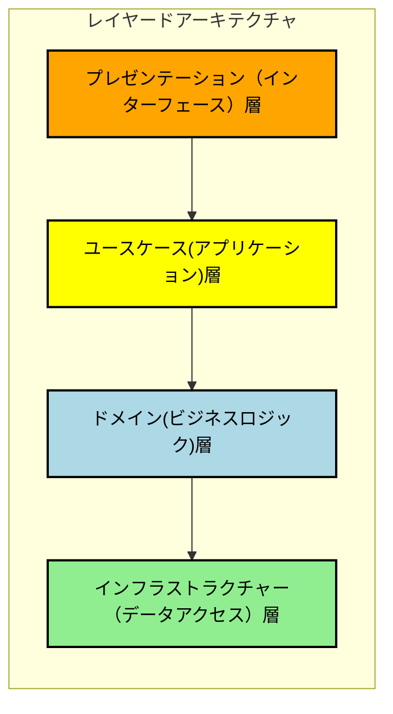
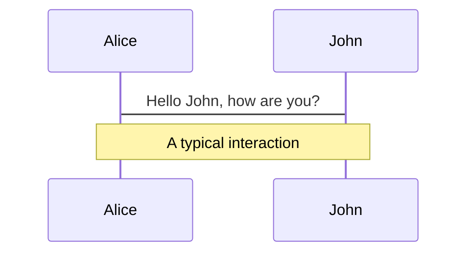
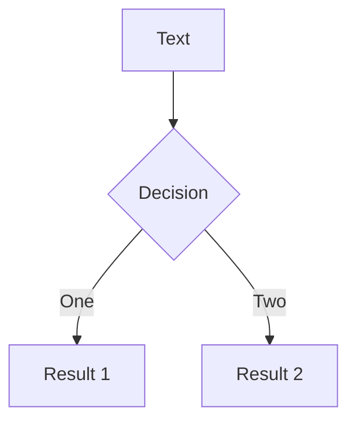
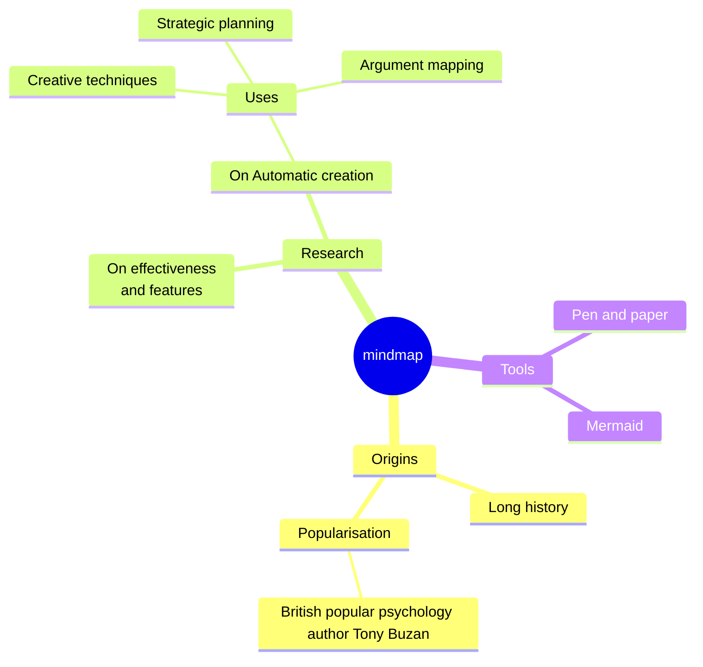
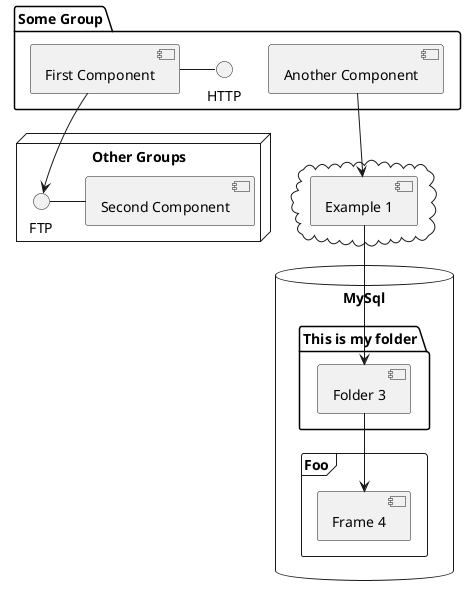

# History of Architecture

2024/08/dd presentation for 社内勉強会

@kazu_kichi_67

<div class="abs-br m-6 flex gap-2">
  <a href="https://x.com/kazu_kichi_67" target="_blank" alt="X" title="Open in X"
    class="text-xl slidev-icon-btn opacity-50 !border-none !hover:text-white">
    <carbon-logo-x />
  </a>
  <a href="https://github.com/kazu-kichi-67" target="_blank" alt="GitHub" title="Open in GitHub"
    class="text-xl slidev-icon-btn opacity-50 !border-none !hover:text-white">
    <carbon-logo-github />
  </a>
</div>

---
src: ./pages/who-am-i.md
hide: false
---

---
hideInToc: true
---

# Agenda

***

<br>
<Toc maxDepth="2"/>

---
layout: section
---

# アーキテクチャーの変遷

---
layout: section
---

## システム全体編

---

### モノリス

***

<div class="grid grid-cols-[30%_70%] gap-4">

<div>
<br>


</div>

<div>

<br>

### メリット

- 1つのアプリケーションのため、デプロイが容易
- スタートアップであれば、これで十分な場合も多い

<br>

### デメリット

- アプリケーションが多くなればなるほど複雑化しやすい（Big Ball of Mat: 大きな泥団子）
  - 修正に対する影響範囲が広く、開発スピードが低下する
  - 影響範囲の特定すら難しく、サービス品質が低下する
- 機能毎にスケールすることが出来ない（弾力性×）
- 1つのアプリケーションがダウンすると、そのままサービス停止へ（耐障害性×）

</div>
</div>

---

### マイクロサービス

***

<div class="grid grid-cols-[30%_70%] gap-4">

<div>
<br>


</div>

<div>

<br>

### メリット

- 機能毎に疎結合となり、互いに修正の影響を受けづらい
- 機能単位でのデプロイ、スケーリングが可能
- 障害の影響を最小限にできる
- コンテナ環境と相性が良い

<br>

### デメリット

- デプロイ、サービス管理のコストが高い
- マイクロサービス間通信によるオーバーヘッド
- 解析時に流れを追うのが難しい
- トランザクションを貼れないため、データの一貫性を担保しづらい
  - sagaパターン
- マイクロサービス間の境界を見極めるのが難しい

</div>
</div>

---

### モジュラモノリス

***

<div class="grid grid-cols-[30%_70%] gap-4">

<div>
<br>


</div>

<div>

<br>

マイクロサービスのデメリットを緩和できる

### メリット

- デプロイ、サービス管理のコストが低め
- モジュール間のやり取りでオーバーヘッドが少ない
- オーケストレーター層を置いてトランザクション管理することも可能
- モジュール間の境界を見誤っても、リカバリしやすい

<br>

### デメリット

- マイクロサービスほど自由にスケール出来ない
- モジュール境界の管理をしっかりやらないと、モノリスと変わらなくなる

マイクロサービスとモジュラモノリスのハイブリットもおすすめ。
組織のスケールに合わせて少しずつマイクサービスへ移行する！

</div>
</div>

---
layout: section
---

## フロントエンド編

---

### MVC

***

<div class="grid grid-cols-[30%_70%] gap-4">

<div>
<br>


</div>

<div>

<br>

### 概要

- Model - View - Controllerに分割する
- Classic MVC、MVC 2とか存在する
- Controllerが入力を受け付けて、Model-Viewの橋渡しを行う
- Struts、Spring MVC、Laravel、CakePHP、FuelPHP、Ruby on Rails

<br>

### メリット

- View（画面のレイアウト）とModel(ビジネスロジックやデータ管理)を分離できる
- 同じModelでViewだけ切り替えることが可能

<br>

### デメリット

- 大規模アプリケーションでは、Controllerが肥大化しやすい
- ViewとModelの結合度が高くなりがち

</div>
</div>

---

### MVP

***

<div class="grid grid-cols-[30%_70%] gap-4">

<div>
<br>


</div>

<div>

<br>

### 概要

- Model - View - Presenterに分離する
- PresenterがModelとViewの仲介を行う

<br>

### メリット

- Presenterがイベントハンドリングを担う
 - ViewがModelの変更を監視する(Observe)パターン
 - パッシブビュー(Passive View)
- パッシブビューによって完全にViewと分離できるので、よりテストがしやすい

<br>

### デメリット

- Presenterが肥大化しやすい
- ViewとPresenterの1対1の関係が必要で、柔軟性に欠ける場合がある

</div>
</div>

---

### MVVM

***

<div class="grid grid-cols-[30%_70%] gap-4">

<div>
<br>


</div>

<div>

<br>

### 概要

- Model - View - ViewModelに分割する
- データバインディング
  - React.js: 単方向バインディング、Vue.ja: 双方向バインディング

<br>

### メリット

- MVPとそこまで変わらないが、ViewとViewModelの連携をフレームワークが担ってくれる

<br>

### デメリット

- 最初の学習コストが高い

</div>
</div>

---
layout: section
---

## バックエンド編

---

### レイヤードアーキテクチャ

***

<div class="grid grid-cols-[30%_70%] gap-4">

<div>
<br>



※ 矢印は依存の向き

※ 3層の場合もある（層の数に決まりはない）

</div>

<div>

<br>

### メリット

- 各層に特定の役割（責務）を与えることで、コードの見通しが良くなる（単一責任の原則 SRP）
- 上層の変更に対して、下層が影響を受けない
  - 使い回しが出来る

<br>

### デメリット

- 下層の変更によって、上層が影響を受ける
- つまり、インフラストラクチャーを変更すると、ビジネスロジックが影響を受けてしまう

ビジネスに価値を提供するビジネスロジック(ドメイン)が最も重要で、そこに注力したい！

</div>
</div>

---

### ヘキサゴナルアーキテクチャ

***

<div class="grid grid-cols-[30%_70%] gap-4">

<div>
<br>
<br>


</div>

<div>

<br>

### メリット

- ほげ

<br>

### デメリット

- ほげ

ほげ

</div>
</div>

---

### オニオンアーキテクチャ

***

<div class="grid grid-cols-[30%_70%] gap-4">

<div>
<br>


</div>

<div>

<br>

### メリット

- ほげ

<br>

### デメリット

- ほげ

ほげ

</div>
</div>

---

### クリーンアーキテクチャ

***

<div class="grid grid-cols-[30%_70%] gap-4">

<div>
<br>
<br>


</div>

<div>

<br>

### メリット

- ほげ

<br>

### デメリット

- ほげ

ほげ

</div>
</div>

---
layout: section
---

# トレンドアーキテクチャー

---
layout: section
---

## CQRS

---

### CQRS

***

<div class="grid grid-cols-[30%_70%] gap-4">

<div>
<br>

図

</div>

<div>

<br>

### メリット

- ほげ

<br>

### デメリット

- ほげ

ほげ

</div>
</div>

---
layout: section
---

## Event Scourcing

---

### Event Scourcing

***

<div class="grid grid-cols-[30%_70%] gap-4">

<div>
<br>

図

</div>

<div>

<br>

### メリット

- 耐障害性
- 弾力性

<br>

### デメリット

- 障害に追いづらい
  - オブザーバビリティが重要

ほげ

</div>
</div>

---
layout: section
---

# Section1

---

## List Sample

***

<br>

<v-clicks>

- aaa
- bbb
- ccc

</v-clicks>

<style>
  ul {
    font-size: 18pt;
  }
</style>

---

## Table Sample

***

Table Sample.

|        |                              |
| ------ | ---------------------------- |
| AAAAAA | aaa                          |
| BBB    | bbbbbbbb                     |
| C      | <kbd>ccccccccccccccccc</kbd> |

---
layout: section
---

<div id="highlight-contents">
highlight!!!
</div>

<style>
  #highlight-contents {
    font-size: 72pt;
  }
</style>

---
layout: section
---

# Section2

---

## Code Sample

***

code sample.

```java {*|3|2-4|1,5|*}
class HelloWorld {
	public static void main(String[] args) {
		System.out.println("Hello, world.");
	}
}
```

<style>
pre.slidev-code {
    background-color: #1f2020;
}
</style>

---

## Diagrams Sample

***

diagrams sample.

<div class="grid grid-cols-4 gap-5 pt-4 -mb-6">









</div>

---

## Tips

***

The <span v-mark.red><code>code</code> directive</span>
also allows you to add
<span v-mark.circle.orange>inline marks</span>
, powered by [Link](https://roughnotation.com/)

<logos-java class="text-7xl m-3 absolute right-20" />

---
layout: center
class: text-center
hideInToc: true
---

# End

<PoweredBySlidev mt-10 />
